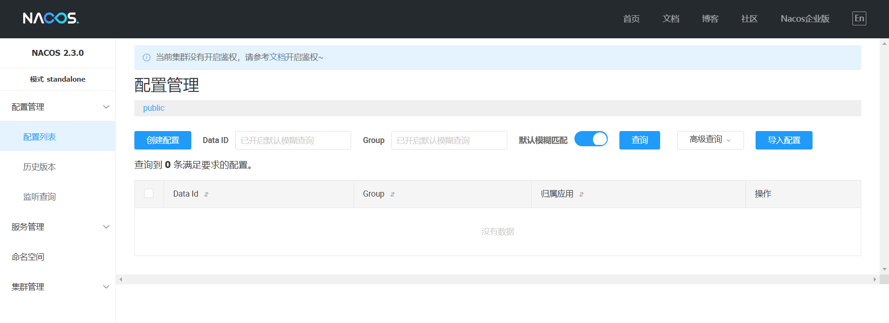
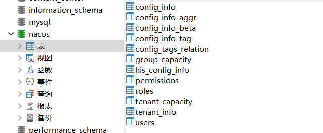
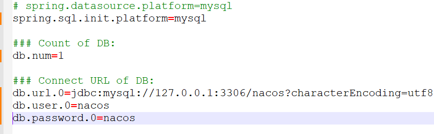
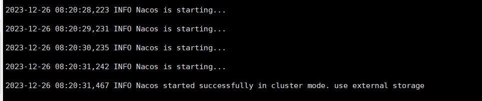
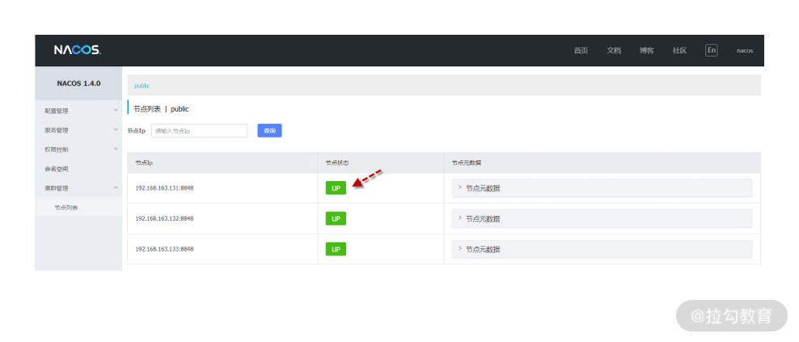

# Nacos 相关

## 一、Nacos CentOS下安装使用

### 第一步、访问 Nacos GitHub：<https://github.com/alibaba/nacos/releases/>获取 Nacos 最新版安装包  

### 第二步、上传Nacos到CentOS系统，对安装包解压缩。
```linux
[root@server-1 local]# tar -xvf nacos-server-2.3.0.tar.gz
```  

### 第三步、以单点方式启动 Nacos。
```linux
[root@server-1 local]# cd nacos/bin
[root@server-1 bin]# sh startup.sh -m standalone
```  

默认 Nacos 以后台模式启动，利用 tail 命令查看启动日志。可以看到 Nacos 默认端口为 8848，下
面日志说明 Nacos 单机模式已启动成功。  
```linux
[root@server-1 bin]# tail -f /usr/local/nacos/logs/start.out
```  
### 第四步、设置防火墙对nacos端口放行。  
|   端口     |   描述     |
| -------- | -------- |
| 8848 | 主端口，客户端、控制台及OpenAPI所使用的HTTP端口 |
| 9848 | 客户端gRPC请求服务端端口，用于客户端向服务端发起连接和请求 |
| 9849 | 服务端gRPC请求服务端端口，用于服务间同步等 |
| 7848 | Jraft请求服务端端口，用于处理服务端间的Raft相关请求 |  

```linux 
[root@server-1 bin]# firewall-cmd --zone=public --add-port=8848/tcp --perm anent
success
```  

```linux 
[root@server-1 bin]# firewall-cmd --zone=public --add-port=9848/tcp --perm anent
success
```  

```linux 
[root@server-1 bin]# firewall-cmd --zone=public --add-port=9849/tcp --perm anent
success
```  

```linux 
[root@server-1 bin]# firewall-cmd --zone=public --add-port=7848/tcp --perm anent
success
```  
重启防火墙使配置生效
```linux 
[root@server-1 bin]# firewall-cmd --reload
success
```  
此时，Nacos 已单机部署完毕。  

### 第五步，进入 Nacos 管理界面  
打开浏览器，地址栏输入：<http://localhost:8848/nacos/>  


## 二、Nacos集群配置

### 第一步、环境准备
Nacos 因为选举算法的特殊性，要求最少三个节点才能组成一个有效的集群，这里需要准备三台服务器（虚拟机）  

### 第二步、下载安装 Nacos  

### 第三步、配置数据库  

使用任意 MySQL 客户端工具连接到 MySQL 数据库服务器，创建名为nacos的数据库，之后使用 MySQL 客户端执
行 nacos/conf/mysql-schema.sql 文件，完成建表工作。  


### 第四步、配置 Nacos 数据源  

依次打开 3 台 Nacos 服务器中的核心配置文件 application.properties，文件路径如下：
```
nacos/conf/application.properties
```  
默认数据源配置都被#号注释，删除注释按下方示例配置数据源即可。


### 第五步、Nacos 集群节点配置  

在 /nacos/config 目录下提供了集群示例文件cluster.conf.example  
首先利用复制命令创建 cluster.conf 文件。  
```
cp cluster.conf.example cluster.conf
```  

之后打开 cluster.conf，添加所有 Nacos 集群节点 IP 及端口。
```
192.168.0.127:8848
192.168.0.139:8848
192.168.0.156:8848
```  

第六步、启动 Nacos 服务器。  
在3台 Nacos 节点上分别执行下面的启动命令。
```linux
sh /usr/local/nacos/bin/startup.sh
```  
**注意：** 集群模式下并不需要增加“-m”参数，默认就是以集群方式启动。  
启动时可以通过 tail 命令观察启动过程。  
```linux
tail -f /usr/local/nacos/logs/start.out
```  

当确保所有节点均启动成功，打开浏览器访问对应的IP地址nacos后台，便可看到集群列表  

  

## 三、Nacos 开启身份认证
Nacos自2.2.2版本开始，在未开启鉴权时，默认控制台将不需要登录即可访问，同时在控制台中给予提示，提醒用户当前集群未开启鉴权。  

在用户开启鉴权后，控制台才需要进行登录访问。  

修改application.properties中的配置信息为：  
```
# 在2.2.0.1版本后默认为false
nacos.core.auth.enabled=true

# 在2.2.0.1版本后默认为空，随自己喜欢自定义
nacos.core.auth.server.identity.key=Feny

# 在2.2.0.1版本后默认为空，随自己喜欢自定义
nacos.core.auth.server.identity.value=Feny

# 自定义密钥时，推荐将配置项设置为Base64编码的字符串，且原始密钥长度不得低于32字符
nacos.core.auth.plugin.nacos.token.secret.key=cjViZWc2MmRndmdwMjNiNGoyNDZnNGN1bTQ0bWpzMXo=
```  
为方便省事，使用Hutool工具生成 nacos.core.auth.plugin.nacos.token.secret.key 的自定义密钥：  
```java
import cn.hutool.core.codec.Base64;
import cn.hutool.core.util.RandomUtil;


System.out.println(Base64.encode(RandomUtil.randomString(32)));
```
