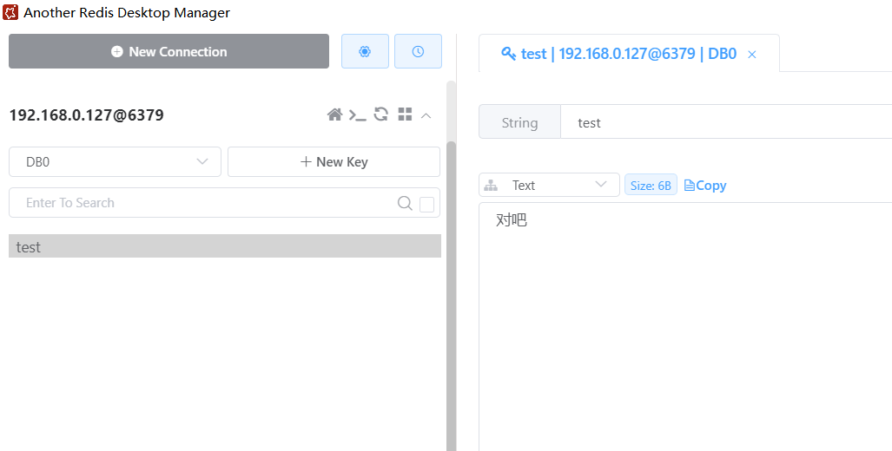

---
date: 2023-12-28
sidebar: false
category:
  - Redis
  - 环境配置
tag:
  - Redis
  - 环境配置
---  

# Redis 安装

## 一、安装依赖

因为 Redis 是用C语言开发的，所以在安装之前需要确定是否安装gcc环境，如果没有安转可以执行一下命令进行安装

```sh
gcc -v
```  

```sh
yum install -y gcc
```

## 二、下载安装

Redis 版本：<http://download.redis.io/releases>  

下载并解压  
```sh
wget http://download.redis.io/releases/redis-6.2.6.tar.gz
tar -zxvf redis-6.2.6.tar.gz
```  

切换到redis解压目录下，执行编译  
```sh
cd redis-6.2.6
make
```  

指定安装目录  
```sh
make install PREFIX=/usr/local/redis
```  

## 三、启动 Redis  

### 1、后台方式启动  

进入到解压的 redis-6.2.6 文件夹中复制 redis.conf 到 redis 的安装目录   
```sh
cp ~/redis-6.2.6/redis.conf /usr/local/redis/bin
```   

进入/usr/local/redis/bin修改 redis.conf 文件，把 daemonize no 改为 daemonize yes  
```sh
vim /usr/local/redis/bin/redis.conf

#搜索daemonize
/daemonize
```  

```sh
# /usr/local/redis/bin/redis.conf
# daemonize no
daemonize yes
```

在 /usr/local/redis/bin 路径下后台启动命令  
```sh
./redis-server redis.conf
```  

查看 是否启动成功  
```sh
ps -ef |grep redis
```

### 2、开机启动  

编辑 /etc/systemd/system/redis.service 文件  
```sh
vim /etc/systemd/system/redis.service
```  

复制粘贴以下内容：  
```sh
[Unit]
Description=redis-server
After=network.target
 
[Service]
Type=forking
ExecStart=/usr/local/redis/bin/redis-server /usr/local/redis/bin/redis.conf
PrivateTmp=true
 
[Install]
WantedBy=multi-user.target
```  

> ExecStart配置成自己的路径    

重新加载系统服务  
```sh
systemctl daemon-reload
```

开机自动启动  
```sh
systemctl enable redis
```

启动redis服务  
```sh
systemctl start redis
```  

创建 Redis 命令软链接
```sh
ln -s /usr/local/redis/bin/redis-cli /usr/bin/redis
```

测试 redis  
```sh
[root@localhost ~]# redis
127.0.0.1:6379>
```


### 3、修改redis密码  

编辑 /usr/local/redis/bin/redis.conf 文件
```sh
vim /usr/local/redis/bin/redis.conf
```

```sh
# /usr/local/redis/bin/redis.conf
# requirepass foobared
# 去掉前面的注释，将foobared 改为自己的密码
 requirepass 123456
```

重启 Redis  
```sh
systemctl restart redis
```

验证 Redis 密码修改是否成功  
```sh
# 输入未输入密码
[root@localhost ~]# redis 
127.0.0.1:6379> keys '*'
(error) NOAUTH Authentication required.

# 输入正确密码
[root@localhost ~]# redis 
127.0.0.1:6379> auth 123456
OK
127.0.0.1:6379> keys '*'
1) "test"

# 输入错误密码
[root@localhost ~]# redis 
127.0.0.1:6379> auth 11
(error) WRONGPASS invalid username-password pair or user is disabled.
```

### 4、设置端口
找到port，修改为想要的端口号  
```sh
vim /usr/local/redis/bin/redis.conf
```
```sh
# /usr/local/redis/bin/redis.conf
# 改为自己的想要的端口
port 6379
```

### 5、允许远程访问  

```sh
vim /usr/local/redis/bin/redis.conf
```  

找到 bind 127.0.0.1 -::1，修改为
```sh
# /usr/local/redis/bin/redis.conf
# bind 127.0.0.1 -::1
bind 0.0.0.0
```

重启 Redis  
```sh
systemctl restart redis
```  

开放 Redis 端口  
```sh
firewall-cmd --zone=public --add-port=6379/tcp --permanent
```  

重启防火墙  
```sh
firewall-cmd --reload
```

测试客户端连接成功  


### 6、服务操作命令 

```sh
#启动redis服务
systemctl start redis
#停止redis服务
systemctl stop redis
#重新启动服务
systemctl restart redis
#查看服务当前状态
systemctl status redis
#设置开机自启动
systemctl enable redis
#停止开机自启动
systemctl disable redis
```

<!-- ## 四、Redis 集群部署 -->