# VirtualBox安装CentOS 

## 一、前期准备工作  

### 1、虚拟机下载  
VirtualBox 的下载页面：<https://www.virtualbox.org/wiki/Downloads>  

### 2、CentOS下载  
CentOS各类型ISO说明  
| 类型     | 说明     |
| -------- | -------- |
| **DVD**  | 标准安装版，里面有很多我们用的常用软件和组件，需要桌面的推荐 |
| **Everything**  | 对完整版安装盘的软件进行补充，集成所有软件 |
| **Minimal：** | 精简版，只有包含系统和很少的软件，用作服务器使用的推荐 |
| **NetInstall** | 网络安装镜像 |

阿里云镜像站的 CentOS 目录： <https://mirrors.aliyun.com/centos/>  
下载 CentOS 7：<https://mirrors.aliyun.com/centos/7.9.2009/isos/x86_64/CentOS-7-x86_64-Minimal-2009.iso>  

网易 163 镜像站的 CentOS 目录： <http://mirrors.163.com/centos>  
下载 CentOS 7：<http://mirrors.163.com/centos/7.9.2009/isos/x86_64/CentOS-7-x86_64-Minimal-2009.iso>  

CentOS 中文站：<https://www.centoschina.cn>  

### 3、windows开启虚拟化功能

如未开启虚拟化功能，请自行上网搜索解决。如下图显示虚拟化已启用。  
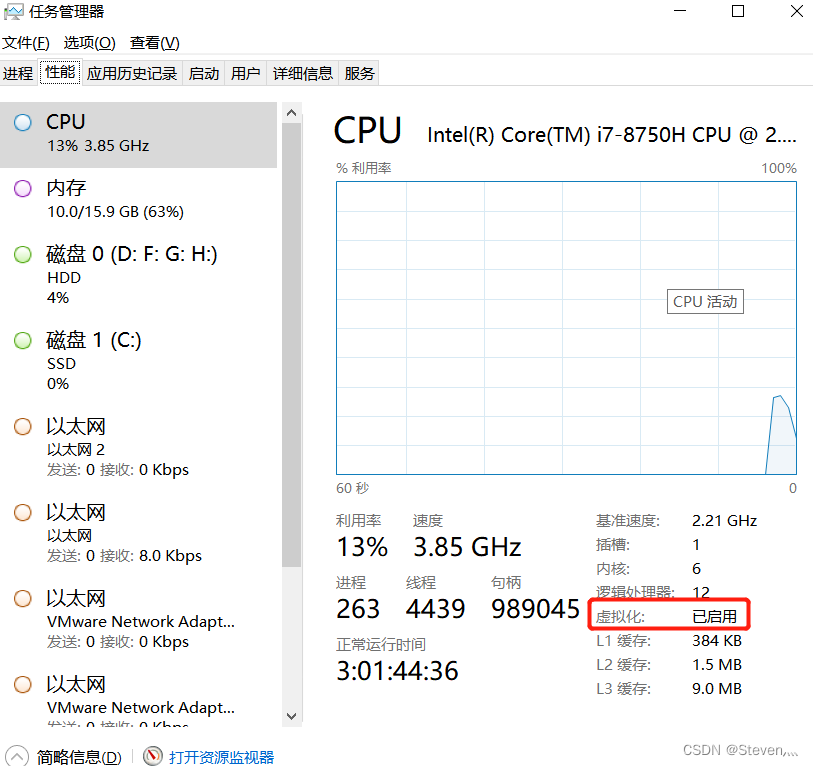  

## 二、虚拟机VirtualBox安装
VirtualBox官网：<https://www.virtualbox.org/wiki/Downloads>  

打开VirtualBox官网如下(Downloads – Oracle VM VirtualBox)，然后点击Downloads - Windows hosts（如下图红色方框选中），即可下载。  
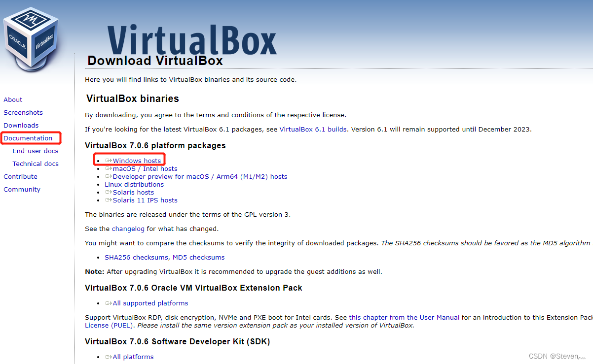  
VirtualBox虚拟机下载完成后，傻瓜式安装，一直点击下一步或者继续即可完成安装。

**注意**：可以根据自己需要修改安装路径。也可默认安装路径，默认安装在C盘。两者操作均可。  

## 三、VirtualBox虚拟机新建虚拟电脑
### 第一步：打开VirtualBox虚拟机，点击新建
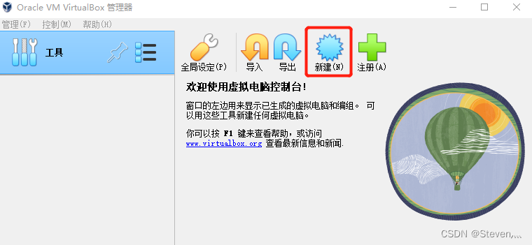  

### 第二步：新建虚拟电脑，名称随意填（自己认识即可），文件夹新建一个自己比较容易找到的目录，虚拟光盘选择下载好的ISO文件，勾选跳过自动安装
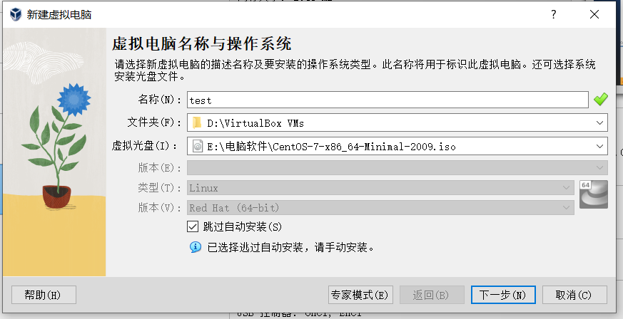

### 第三步：划分内存以及处理器设置，这地方大家自行根据自己电脑进行配置
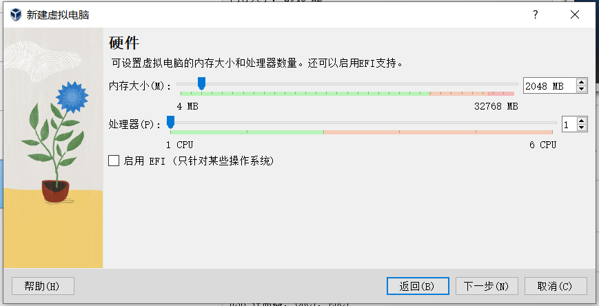

### 第四步：接着分配硬盘大小，完成配置后，点击下一步。我这边默认20G，足够上课实践中使用。可根据自己硬盘情况调整 
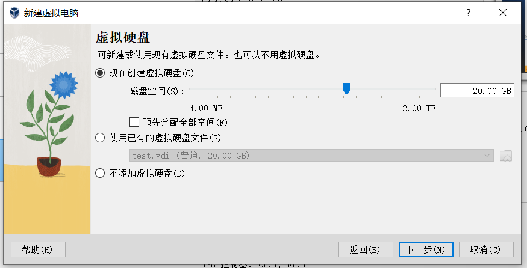

### 第五步：点击完成即可

## 四、在VirtualBox虚拟机中安装Centos系统

### 第一步：启动虚拟机，点击启动即可（这地方需要稍等一会，系统正在做程序校验）
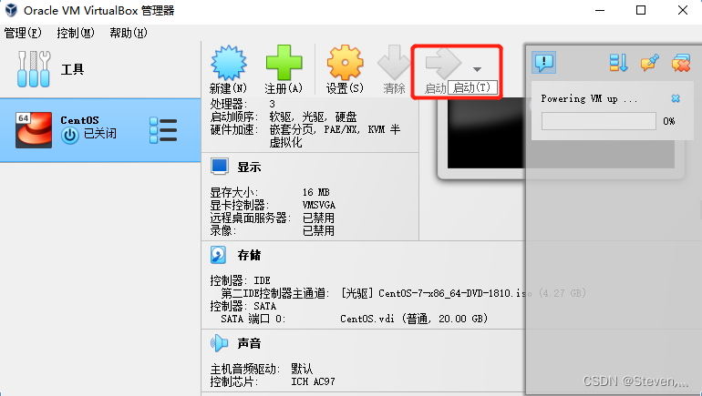  

### 第二步：系统校验完成后，就到了安装Centos系统的主界面了。这地方可以选择语言，我这主要采用的是默认English，你也可选择简体中文。但建议选择English，方便后续跟着学习，如果想走的更远，英文这关肯定得过。 点击Continue
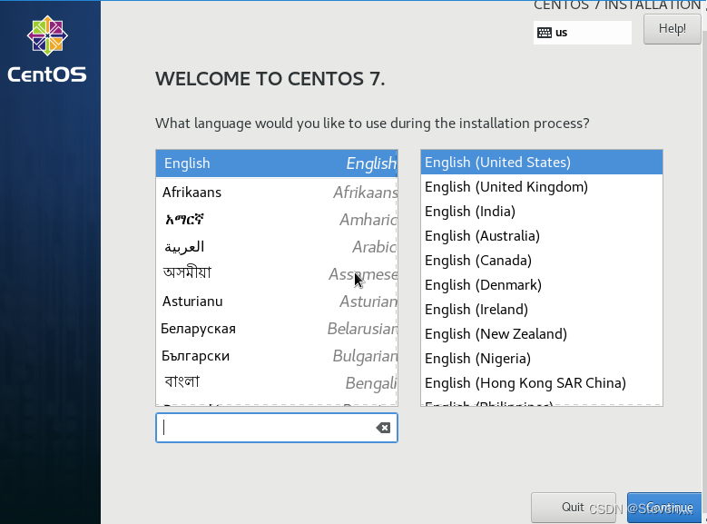  

### 第三步：接着进行一些设置：其他设置都可以采用默认

我们需要点击SYSTEM中的 INSTALLATION DESTINATION 即可，进去之后不需要做任何配置，再点击左上角的Done，即可。完成后Begin installation由灰色变成蓝色，即变为可点击的状态。
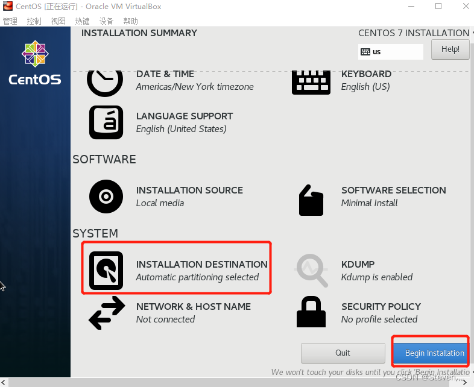  
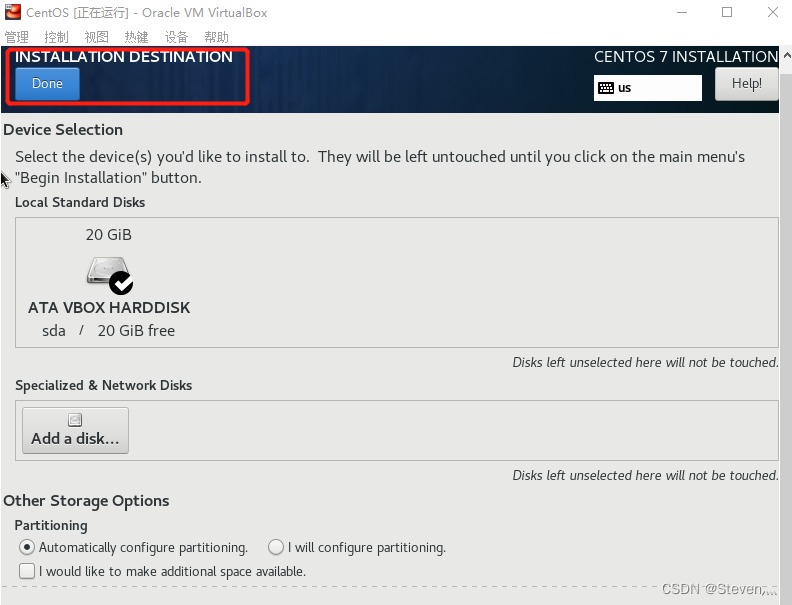

### 第四步：点击Begin installation开始安装，安装需要一些时间，请耐心等待
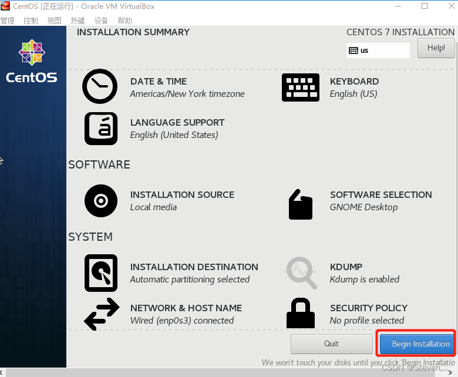  

### 第五步：系统正在安装中，安装的过程中，我们可以设置ROOT密码
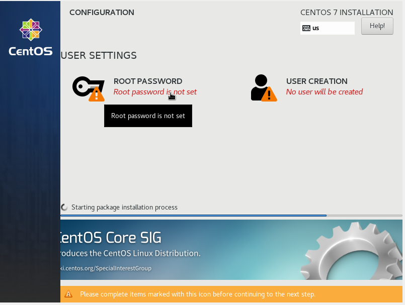 
  
ROOT密码我这地方设置为123456。当然建议密码中包含：大写字母+小写字母+数字+特殊字符。  
点击Done按钮完成root密码设置。

操作设置成功后，就等完成安装了，请耐心等待。  
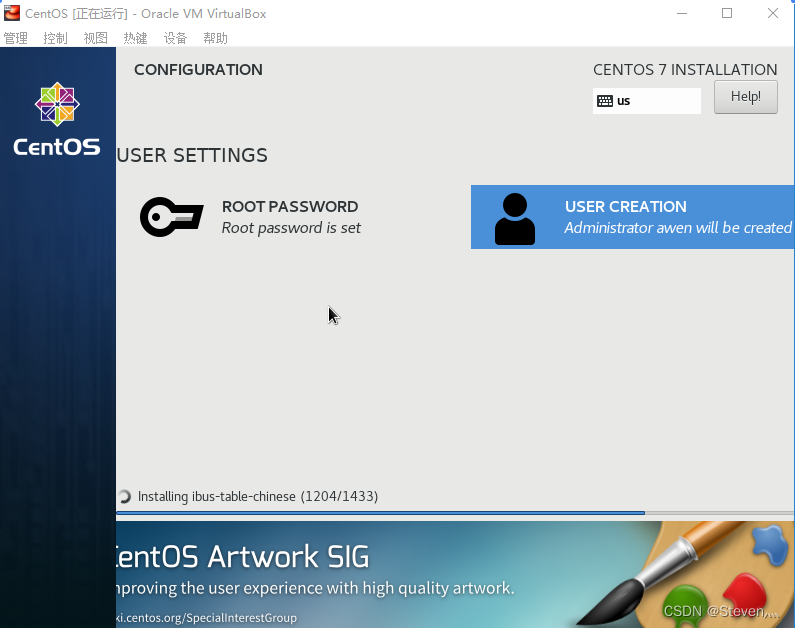  

### 第六步：完成之后，点击右下角Rebot，重启
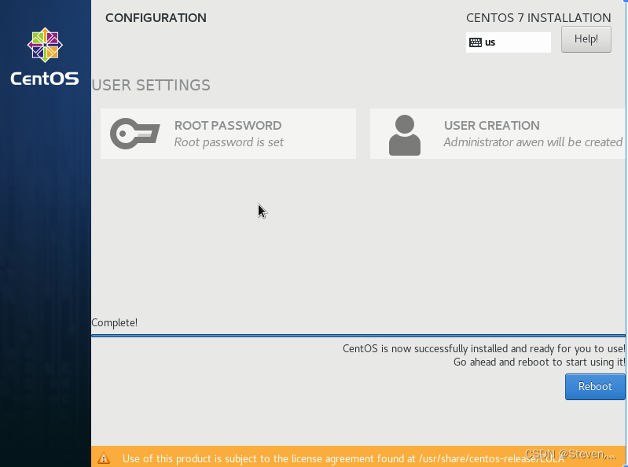  

耐心等待后就是我们熟悉的界面了，输入root账号和密码即可登录。  
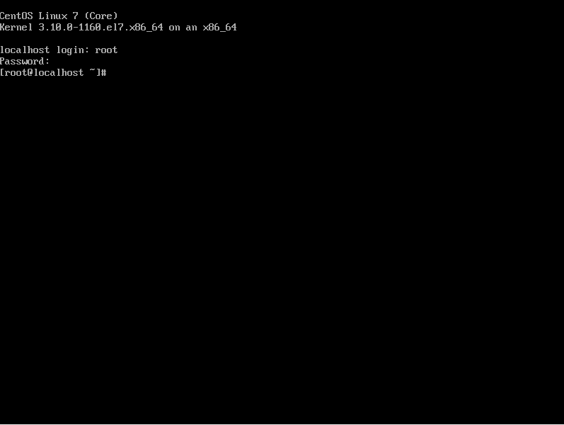  

如果习惯使用Xshell等其他连接工具，VirtualBox可以使用无界面启动的方式。  
  

启动成功后即可使用Xshell连接  
  

## 五、其他
1、开发中虚拟机需要连接外部宿主IP，但ping不通问题  
**原因：** 宿主主机防火墙拦截了虚拟机IP  
**解决办法：** 关闭电脑防火墙